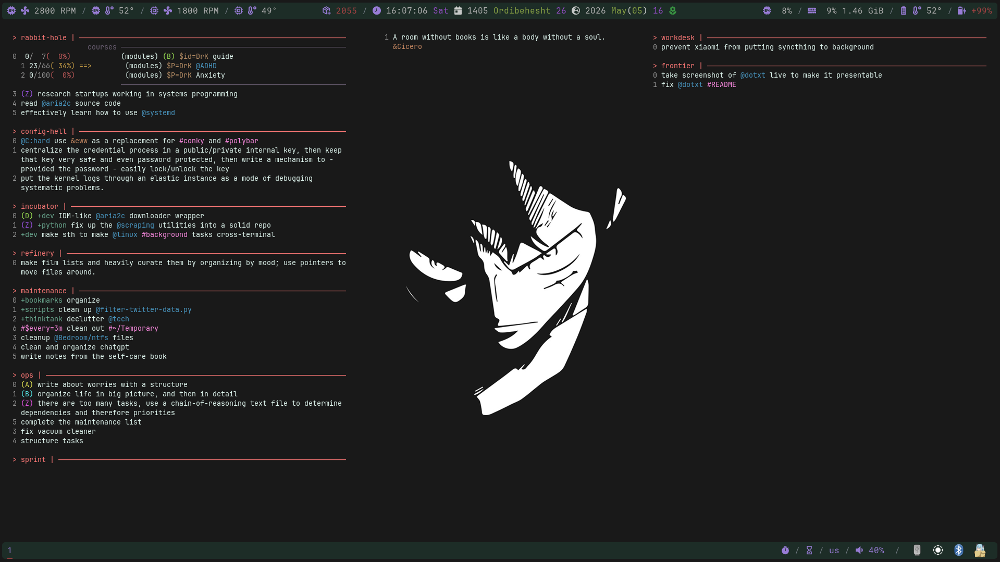

# dotxt

A text-based todo manager for the terminal, inspired by [Todo.txt](http://todotxt.org/).

dotxt extends plain text files with a structured token syntax — dates, recurrence, 
priorities, progress tracking, and parent-child task relationships — while keeping 
the file human-readable and editable by hand. A bidirectional parser ensures that 
what you write is what gets printed back.



---

## Format

Tasks live in plain text files organized in a directory you configure. Each line 
is a task. Tokens are space-separated and parsed word by word.

### Hints

They consist `!`, `@`, `#`, `&`, `*`, `+`, and `?`.
Symbols only work as prefixes. As standalone words, postfixes, or mid-word they 
are treated as plain text.

### Variables

| Variable       | Meaning                        | Example                      |
|----------------|-------------------------------|------------------------------|
| `$c=`          | Creation date                  | `$c=2024-05-01`              |
| `$due=`        | Due date                       | `$due=2024-06-01`            |
| `$end=`        | End date                       |                              |
| `$dead=`       | Hard deadline                  |                              |
| `$every=`      | Recurrence interval            | `$every=3m`                  |
| `$r=`          | Reminder datetime              |                              |
| `$id=`         | Task identifier                | `$id=DrK`                    |
| `$P=`          | Parent task reference          | `$P=DrK`                     |
| `$p=`          | Progress tracker               | `$p=page/53/453/books`       |

Dates accept both absolute (`YYYY[-mm[-dd]][THH[-MM[-SS]]]`) and relative formats 
(`c:-1y2m3w4d5h6M7s` meaning 1 year 2 months 3 weeks... before creation date).

Parent-child relationships are formed within a file using `$id=` and `$P=`. 
A task can have multiple children.

### Quotation

Single quotes, double quotes, and triple backticks are supported for multi-word values.

### Render

The print function renders and prints the tasks, wherein every special value including 
hints, variables, relationships and quotation are highlighted.
The colorization can be modified through the config file.

---

## Configuration

The defaults exist [here](config/defaults.go)

---

## Usage

```
dotxt [command]}

Available Commands:
  add                  add task
  app, append          append to task
  check                check for a variety of things to fix
  completion           Generate the autocompletion script for the specified shell
  deduplicate, dedup   deduplicate list
  del, rm              delete task
  depri, dp            deprioritize task
  done, do             finish and move task
  help                 Help about any command
  inc                  increment the count of a progress task
  lsn                  print a single task from list
  migrate              migrate tasks from a given file
  move, mv             move task around
  prepend, prep        prepend to task
  pri, p               prioritize task
  print                print tasks from lists
  print1               print a single task from list
  replace, update      replace line with a new task
  revert               revert tasks from done to list
  setc                 set the count on a progress task
  sort                 sort the tasks of the list in-place
  tc                   toggle the collapse/expanse of the children of a task

Flags:
      --clvl int        console log -1 <= level <= 5 (default 5)
      --color           enable colored mode
  -c, --config string   yaml config filepath
  -h, --help            help for dotxt
```

---

## Installation

*TODO*

There's no installation method as of yet, if you intend to take it for a spin, you gotta clone it,
install the go packages, and use the [make file](MakeFile) to test and build it,
then you can run the binary, which will produce the configuration file in `~/.config/dotxt`.

You can if you like pipe it through to conky and use it like I did, but that's ill-advised since
that's not a passive process and it takes more computation than necessary.

---

## Status

Early development. The format and CLI are stable enough for personal use; 
breaking changes are possible.

---

## Roadmap

- The first task in line is to create a concurrency module that'll make the whole app into a client/server so
that the server caches the files and works through triggers and events.
- The second task is a proper refactoring, minor redesigning, and testing.
- The third one is developing micro interfaces that'll help interact with the app properly. e.g. a client for ELKowards Wacky Widgets. Or a tui that'll behave similar to a more normal todo list.
